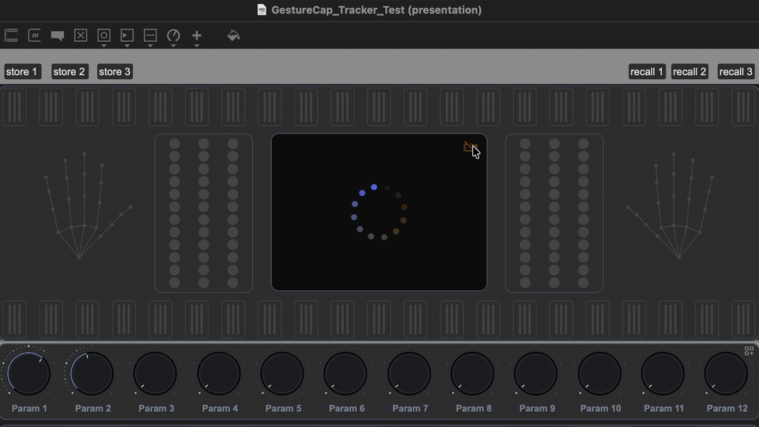
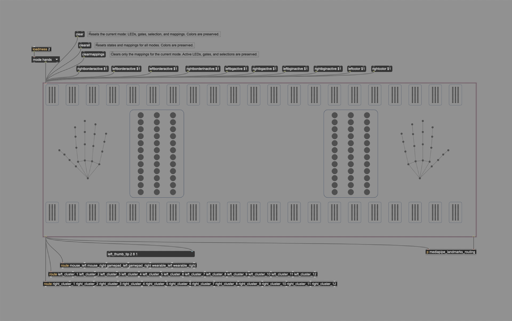
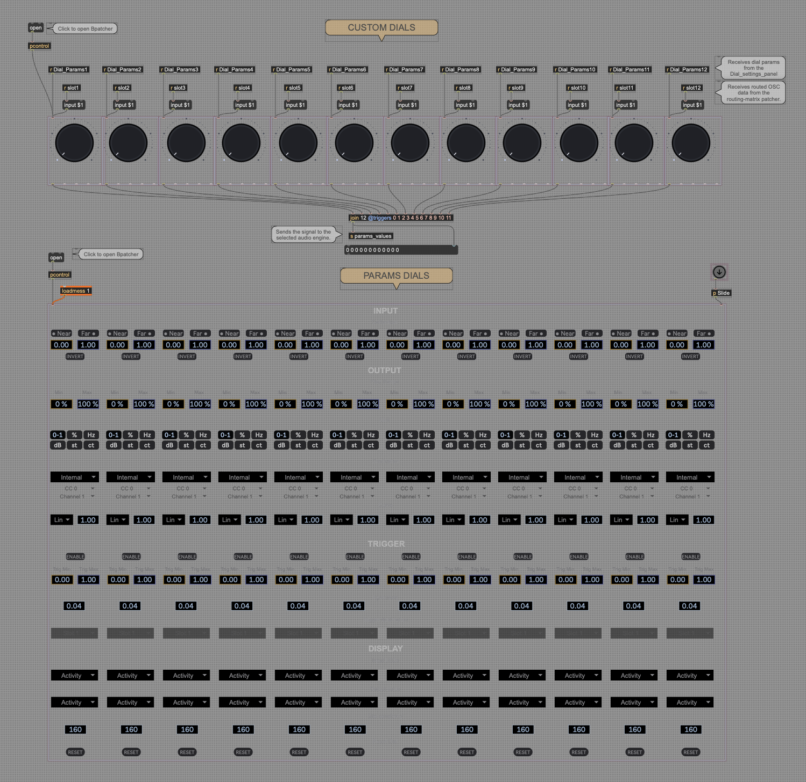

# GestureCap OSC

Run MediaPipe locally, route gesture data in Max/MSP, and control audio, visual, or other parameters.

GestureCap OSC packages the MediaPipe tracker so it can run locally without sending camera data to a cloud service. The tracker can be launched directly from Max/MSP, embedded in a Max Project, or included in a standalone application.

The repository connects three main stages:

```text
Local MediaPipe tracking
        ↓ OSC — 127.0.0.1:11111
Gesture routing matrix
        ↓
12 custom parameter dials
        ↓
Audio, visuals, or other processes
```

By default, tracking and OSC communication stay on the local machine. Camera frames are processed locally and only landmark data is sent to Max.



---

## Why This Repository

The main goal is to make a MediaPipe-based gesture pipeline portable and practical inside Max/MSP applications:

- Run hand tracking locally and privately
- Launch the packaged tracker from Max
- Embed the tracker in a Max Project or standalone application
- Visualize MediaPipe landmarks inside Max
- Route gesture axes to 12 destination parameters
- Calibrate and shape each parameter with custom JSUI dials
- Reuse the routing matrix with OSC, USB, or Bluetooth controllers

---

## Main Components

### MediaPipe Tracker

The packaged tracker runs MediaPipe and OpenCV locally. It supports up to two hands with 21 landmarks per hand and sends X, Y, and Z values to:

```text
/hand/left
/hand/right
```

Default OSC destination:

```text
127.0.0.1:11111
```

The tracker can display its own OpenCV preview while `mediapipe_handdraw.js` renders the landmark data inside Max/MSP.

### Gesture Routing Matrix

The routing matrix is designed primarily around MediaPipe data.



Primary modes:

- **Hands** — direct access to the 21 landmarks of each hand
- **Clusters** — grouped MediaPipe sources for higher-level gesture control

Additional controller modes:

- **Wearable** — OSC data from wearable controllers
- **Gamepad** — USB or Bluetooth exploration and parameter control
- **Mouse** — manual exploration, testing, and parameter control

Each mode preserves its own active sources, selections, and mappings.

#### Matrix messages

The matrix accepts the following control messages:

| Message | Behavior |
| --- | --- |
| `mode hands` | Selects the Hands mode. Replace `hands` with `clusters`, `wearable`, `gamepad`, or `mouse` to select another mode. |
| `clear` | Resets LEDs, gates, selections, and mappings for the current mode. Colors are preserved. |
| `clearall` | Resets states and mappings for every mode. Colors are preserved. |
| `clearmappings` | Clears only the mappings for the current mode. Active LEDs, gates, and selections are preserved. |
| `rightborderactive $1` | Sets the active-border value for the right-hand side. |
| `leftborderactive $1` | Sets the active-border value for the left-hand side. |
| `rightborderinactive $1` | Sets the inactive-border value for the right-hand side. |
| `leftborderinactive $1` | Sets the inactive-border value for the left-hand side. |
| `rightbgactive $1` | Sets the active-background value for the right-hand side. |
| `leftbgactive $1` | Sets the active-background value for the left-hand side. |
| `rightbginactive $1` | Sets the inactive-background value for the right-hand side. |
| `leftbginactive $1` | Sets the inactive-background value for the left-hand side. |
| `rightcolor $1` | Sets the right-hand display color value. |
| `leftcolor $1` | Sets the left-hand display color value. |

In Max message boxes, `$1` is replaced by the value sent to the message.

See [Gesture Routing Matrix](docs/routing-matrix.md) for messages, outputs, colors, and state behavior.

### Custom Parameter Dials

Twelve reusable JSUI dials process normalized controller data through:



```text
Raw Input
→ Near / Far
→ Invert
→ Exponent
→ Playable Range
→ Unit Display
→ Triggers
```

See [Custom JSUI Dials](docs/custom-dials.md) for messages, outlets, and display behavior.

---

## Quick Start — Max/MSP, No Python Installation

The packaged tracker is launched directly by the Max patch. Python does not need to be installed on the performance machine.

### 1. Download and extract the packaged tracker — required

The compiled tracker is not stored in the Git repository. Before opening the Max patch, download `gesturecap-tracker-macos-arm64.zip` from the [latest GitHub Release](https://github.com/mikaelmolliex/gesturecap-osc/releases/latest).

This build is currently provided for macOS Apple Silicon (`arm64`).

Extract the archive and place the resulting `doublehand_mp/` folder inside `dist/` at the repository root.

The final project structure must be:

```text
gesturecap-osc/
├── dist/
│   └── doublehand_mp/
│       ├── doublehand_mp
│       └── _internal/
└── max/
    ├── GestureCap_Tracker_Test.maxpat
    ├── run_mediapipe_maxmsp.js
    ├── mediapipe_handdraw.js
    ├── gesture_mapper_ui_multimode_extended.js
    └── custom.dial.v9.js
```

The complete `_internal/` directory must remain beside the `doublehand_mp` executable. Do not move the executable by itself.

### 2. Open the Max patch

```text
max/GestureCap_Tracker_Test.maxpat
```

### 3. Enable the camera/video control

Max launches the packaged tracker. The tracker opens its OpenCV preview and sends MediaPipe landmarks to the visualizer embedded in the Max patch.

The initial launch can take approximately 20–30 seconds while the packaged runtime, MediaPipe, OpenCV and supporting resources load.

### Tracker placement and launcher paths

For the regular Max patch, [`max/run_mediapipe_maxmsp.js`](max/run_mediapipe_maxmsp.js) resolves the tracker relative to the launcher script:

```javascript
const TRACKER_PATH = path.join(
    __dirname,
    "..",
    "dist",
    "doublehand_mp",
    "doublehand_mp"
);
```

The extracted executable must therefore exist at:

```text
dist/doublehand_mp/doublehand_mp
```

If the tracker is moved elsewhere, update the `TRACKER_PATH` block in the launcher that you use:

- [`max/run_mediapipe_maxmsp.js`](max/run_mediapipe_maxmsp.js) — regular Max patch; expects the tracker in `dist/doublehand_mp/` at the repository root.
- [`max/run_mediapipe_maxmsp_project.js`](max/run_mediapipe_maxmsp_project.js) — Max Project; resolves a bundled `tracker/doublehand_mp/` directory relative to the project launcher.
- [`max/run_mediapipe_standalone.js`](max/run_mediapipe_standalone.js) — standalone application; update the application name or absolute bundle path to match `YourApp.app/Contents/Resources/tracker/doublehand_mp/doublehand_mp`.

In every configuration, keep the complete `_internal/` directory beside the `doublehand_mp` executable.

See [Max/MSP Integration](docs/max-integration.md) for the regular patch, Max Project, and standalone launchers.

---

## Packaged Tracker and `dist/`

The local `dist/` directory contains the complete PyInstaller tracker. It is a generated binary package and is intentionally kept outside normal Git tracking.

Recommended distribution:

1. Compress `dist/doublehand_mp/` as `gesturecap-tracker-macos-arm64.zip`.
2. Attach the archive to a GitHub Release.
3. Ask users to extract it into the repository root so that `dist/doublehand_mp/` is restored.
4. Keep `dist/` in `.gitignore` to avoid adding the 217 MB generated bundle to every Git clone.

The current packaged tracker is built for macOS Apple Silicon (`arm64`). Intel macOS and Windows require separate builds and release assets.

Developers who want to run from Python source can use the repository's Python environment. See [Build Tracker on macOS](docs/build-tracker.md) for the PyInstaller workflow.

---

## Main Files

```text
max/GestureCap_Tracker_Test.maxpat       Main Max/MSP demonstration patch
dist/doublehand_mp/                      Packaged local MediaPipe tracker
max/mediapipe_handdraw.js                Landmark visualizer
max/gesture_mapper_ui_multimode_extended.js
                                         Gesture routing matrix
max/custom.dial.v9.js                    Custom parameter dial
max/run_mediapipe_maxmsp.js              Regular Max patch launcher
max/run_mediapipe_maxmsp_project.js      Max Project launcher
max/run_mediapipe_standalone.js          Standalone application launcher
```

---

## macOS Standalone Deployment

For a standalone application, the tracker can be embedded at:

```text
YourApp.app
└── Contents
    └── Resources
        └── tracker
            └── doublehand_mp/
                ├── doublehand_mp
                └── _internal/
```

Camera access may require `NSCameraUsageDescription`, a camera entitlement, application signing, and a TCC permission reset during development.

See [macOS Camera Permissions](docs/macos-camera-permissions.md) for the complete workflow.

---

## Project Origin

GestureCap OSC is based on the original GestureCap project developed during Google Summer of Code 2025 under the INCF organization.

This repository includes work developed as part of my contribution to Google Summer of Code 2026. It extends the original pipeline with local OSC integration, Max/MSP routing, packaged tracker deployment, embedded visualization, and custom parameter interfaces.

---

## Visual Assets

Interface icons are sourced from [Iconoir](https://iconoir.com/).

---

## License

See the project license for details.
